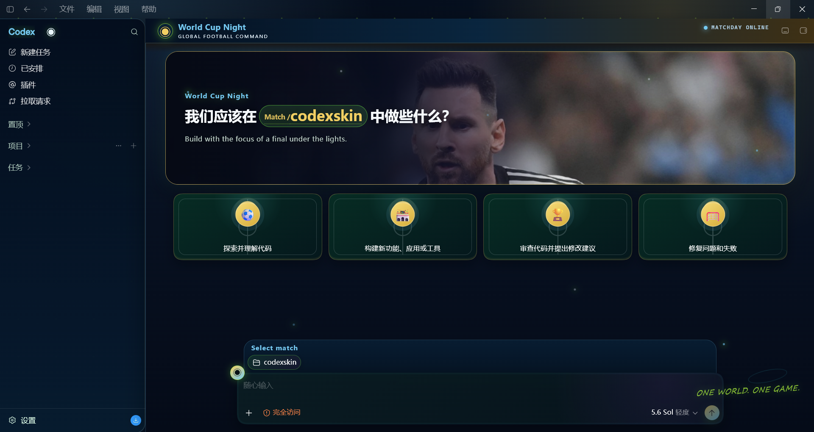
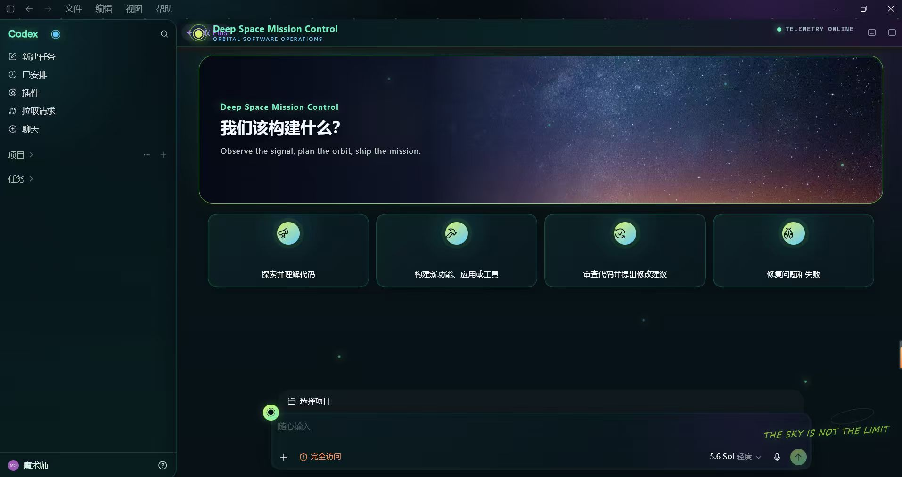
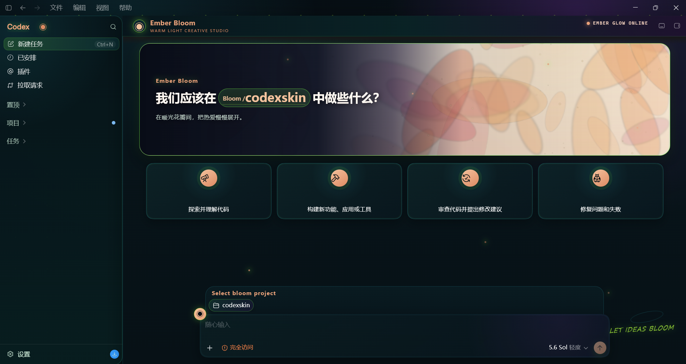
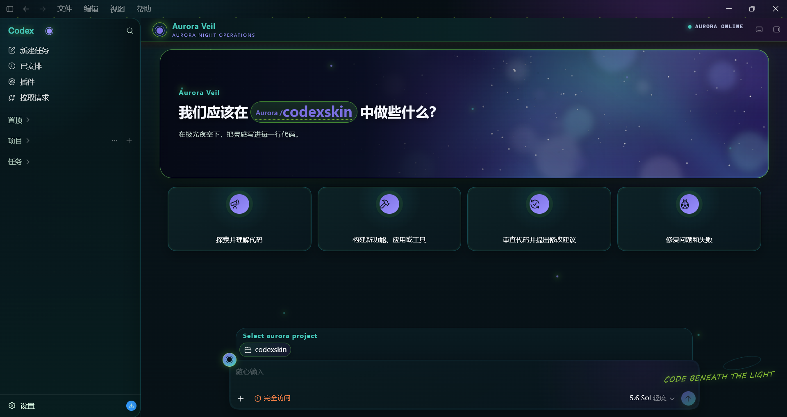

<div align="center">

# Codex SkinKit

为 Windows 版 Codex 打造的非官方主题工具包：一键安装、切换和自定义背景，同时保留原生界面的完整交互能力。

[English](./README_EN.md) · [快速开始](#快速开始) · [主题预览](#内置主题) · [安全说明](#安全说明) · [赞助与联系](#赞助与联系)

</div>

## 这是什么

Codex SkinKit 为 Microsoft Store 版 Codex 添加可定制的首页横幅和任务背景。侧边栏、卡片、项目选择器、任务内容、菜单和输入框仍然可以正常交互。

项目不会修改官方 MSIX 安装包或 `app.asar`。主题通过仅监听 `127.0.0.1` 的本地 Chrome DevTools Protocol 调试会话注入，恢复后即可回到 Codex 原始外观。

## 效果预览

<table>
  <tr>
    <th width="33.33%">World Cup Night</th>
    <th width="33.33%">Deep Space Mission Control</th>
    <th width="33.33%">Ember Bloom</th>
  </tr>
  <tr>
    <td><a href="./assets/readme/world-cup-night-preview.png"></a></td>
    <td><a href="./assets/readme/deep-space-preview.png"></a></td>
    <td><a href="./assets/readme/ember-bloom-preview.png"></a></td>
  </tr>
  <tr>
    <th>Aurora Veil</th>
    <th></th>
    <th></th>
  </tr>
  <tr>
    <td><a href="./assets/readme/aurora-veil-preview.png"></a></td>
    <td></td>
    <td></td>
  </tr>
</table>

## 功能

- 双击脚本即可完成安装、启动、验证和恢复
- 在 5 套内置主题之间快速切换
- 使用自己的 PNG 或 JPEG 图片创建主题
- 自动保存并恢复 Codex 原始基础色
- 校验 Codex 包、Node.js 签名及复制文件哈希
- 无需全局安装 Node.js

## 系统要求

- Windows 10 或 Windows 11（x64）
- 从 Microsoft Store 安装的官方 Codex App
- PowerShell 5.1 或更高版本

> 当前版本仅支持 Windows，不支持其他安装来源的 Codex。

## 快速开始

1. 安装并至少启动一次官方 Codex App，然后关闭 Codex。
2. 下载本仓库，并完整解压到一个普通文件夹中。
3. 双击 `Codex SkinKit.cmd`，选择 **Install / Update**。
4. 按提示允许 Codex 重启。

安装完成后，桌面只会生成一个 `Codex SkinKit.cmd`。双击即可打开管理中心：

| 管理中心操作 | 用途 |
| --- | --- |
| Install / Update | 安装或更新 SkinKit |
| Start Codex | 以当前主题启动 Codex |
| Switch Theme | 切换内置主题 |
| Customize Theme | 使用自己的图片创建主题 |
| Verify Theme | 检查主题状态并保存验证截图 |
| Restore Codex | 移除主题并恢复 Codex 原始外观 |

## 内置主题

| Open Portal | Deep Space Mission Control | World Cup Night |
| --- | --- | --- |
|  |  |  |

| Aurora Veil | Ember Bloom |
| --- | --- |
|  |  |

Aurora Veil 与 Ember Bloom 改编自 [Finderchangchang/codex-autoskin](https://github.com/Finderchangchang/codex-autoskin) 的 MIT 许可原创演示主题，并已转换为 SkinKit 的主题配置格式。

打开桌面的 `Codex SkinKit.cmd`，选择 **Switch Theme**，再选择主题并点击 **Apply**。切换主题时 Codex 会按需重启。

## 自定义主题

打开管理中心并选择 **Customize Theme**，然后选择不超过 16 MB 的 PNG、JPG 或 JPEG 图片。

建议使用宽度至少为 2000 px 的横向图片，并避免把重要主体放在图片左侧，以免被界面内容遮挡。

如需通过命令行进一步设置名称、文案和颜色，可运行：

```powershell
powershell -NoProfile -ExecutionPolicy Bypass -File .\scripts\customize-theme-windows.ps1 `
  -Image "C:\path\to\background.jpg" `
  -Name "My Theme" `
  -Accent "#7cff46"
```

## 验证与测试

打开管理中心并选择 **Verify Theme**。验证成功时会返回 `pass: true`，并在桌面保存 `Codex SkinKit Verification.png`。

开发者也可以在仓库目录运行：

```powershell
npm test
```

或：

```powershell
powershell -NoProfile -ExecutionPolicy Bypass -File .\tests\run-tests-windows.ps1
```

## 恢复原始界面

打开管理中心并选择 **Restore Codex**。脚本会移除当前主题、恢复已保存的 Codex 基础色、关闭本地调试会话，并正常重启 Codex。

## 安全说明

- 只接受官方 `OpenAI.Codex` Microsoft Store 包。
- 不修改官方安装包、签名或 `app.asar`。
- Chrome DevTools Protocol 只监听本机 `127.0.0.1`。
- 注入器只接受 Codex 原生的 `app://` 页面。
- 会验证随附 Node.js 的数字签名和复制文件的哈希。

主题启用期间，CDP 是本机上的未认证调试接口。请勿同时运行不可信的本地软件；不需要主题时，建议使用 Restore 关闭调试会话。

## 常见问题

### 安装器提示找不到 Codex 配置

先正常启动一次官方 Codex App，等待首页加载完成后关闭，再重新运行安装器。

### 自定义图片无法使用

确认图片格式为 PNG、JPG 或 JPEG，且文件大小不超过 16 MB。

### 想彻底停用主题

打开桌面的 `Codex SkinKit.cmd` 并选择 **Restore Codex**。以后需要时可以通过 **Install / Update** 重新安装。

## 赞助与联系

如果 Codex SkinKit 对你有帮助，欢迎通过赞赏码支持项目维护。产品合作、项目赞助、问题反馈或 Codex 相关交流，可以扫码添加微信；添加时请注明来意。

| 微信联系 | 赞赏支持 |
| --- | --- |
|  |  |

> 以上联系方式和赞赏方式与 [Learn Codex](https://github.com/ismoshushi/learn-codex) 项目一致。

## 参与贡献

欢迎提交 Issue 或 Pull Request。请尽量说明 Windows 版本、Codex 版本、复现步骤和验证结果；涉及界面问题时，附上截图会更容易定位。

## 致谢

感谢 [Finderchangchang/codex-autoskin](https://github.com/Finderchangchang/codex-autoskin) 项目及其作者 Vikicc。该项目提供了程序化生成的原创主题素材和完整的主题设计思路；本项目中的 `Aurora Veil` 与 `Ember Bloom` 在其 MIT 许可基础上适配为 Codex SkinKit 的主题格式。

## 声明与许可证

本项目采用 [MIT License](./LICENSE)。Codex 和 OpenAI 是 OpenAI 的商标。

Codex SkinKit 是社区维护的非官方项目，与 OpenAI 无隶属关系，也未获得 OpenAI 认可或背书。用户提供的图片仍由其原权利人所有，MIT License 不授予这些图片或相关商标的使用权。
